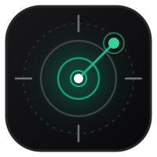

<p align="center">
  
</p>

<h1 align="center">CareerRadar</h1>

<p align="center">
  <strong>Real-time developer job fit copilot powered by Jev System One (<code>@typesafe-ai/sdk</code>).</strong><br>
  Evaluates live job postings on LinkedIn against candidate verified systems scale in sub-800ms.
</p>

---

## ⚡ Quick Setup

### 1. Install & Configure
```bash
git clone git@github.com:GauravAhuja7/CareerRadar.git
cd CareerRadar
npm install
```

Create a `.env` file in the root directory:
```env
JEV_API_KEY=your_typesafe_jev_api_key_here
PORT=3001
```

### 2. Start Local Engine
```bash
npm run dev
```
* API Server: `http://localhost:3001`
* Web Hub: `http://localhost:5173`

### 3. Load Chrome Extension
1. Open Chrome and navigate to `chrome://extensions`.
2. Toggle **Developer mode** (top right) ON.
3. Click **Load unpacked** and select the [`extension/`](extension/) directory from this repo.
4. Pin **CareerRadar** and open any job listing on **LinkedIn**, **Indeed**, **Wellfound**, **Greenhouse**, or **Ashby**.

---

## 🛠️ What I Built & How It Works

1. **Anti-Slop Architecture**: Replaced slow generative LLMs with **Jev System One** (`jev-latest`): evaluating state against typed mathematical primitives (`choice`, `score`, `noul`) rather than streaming hallucinated text.
2. **Context Subagent**: An in-browser content observer detects active job postings, extracts clean qualification requirements, and pairs them against uploaded candidate resume vectors without DOM shift.
3. **Speculative Fan-Out**: Evaluates application verdicts (`CAN_APPLY`, `REACH_APPLY`, `SKILL_MISMATCH`), technical synergy (/4), and screening odds in a single parallel inference pass.
4. **Scope-Over-Tenure Engine**: Distinguishes calendar years from verified scale (e.g., proves how 1.5 yrs building high-throughput Kafka/AWS pipelines offsets a "3-5 yrs required" requirement).
5. **Linear/Raycast UI**: Built a restrained Chrome side panel exposing live fit gauges, skill alignment bars, and 1-click tailored interview pitches.
6. **Telemetry & Calibration**: A slide-up reasoning drawer surfaces raw Bayesian probability distributions and confidence scores in <800ms.
